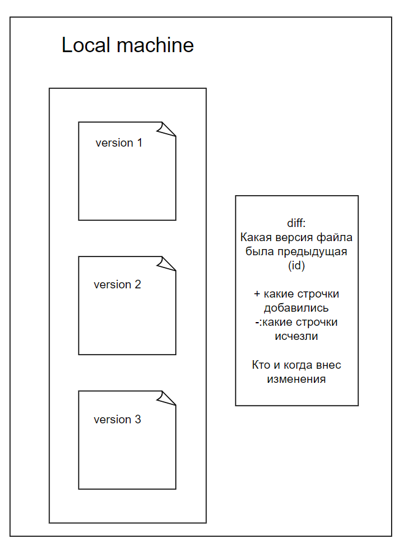
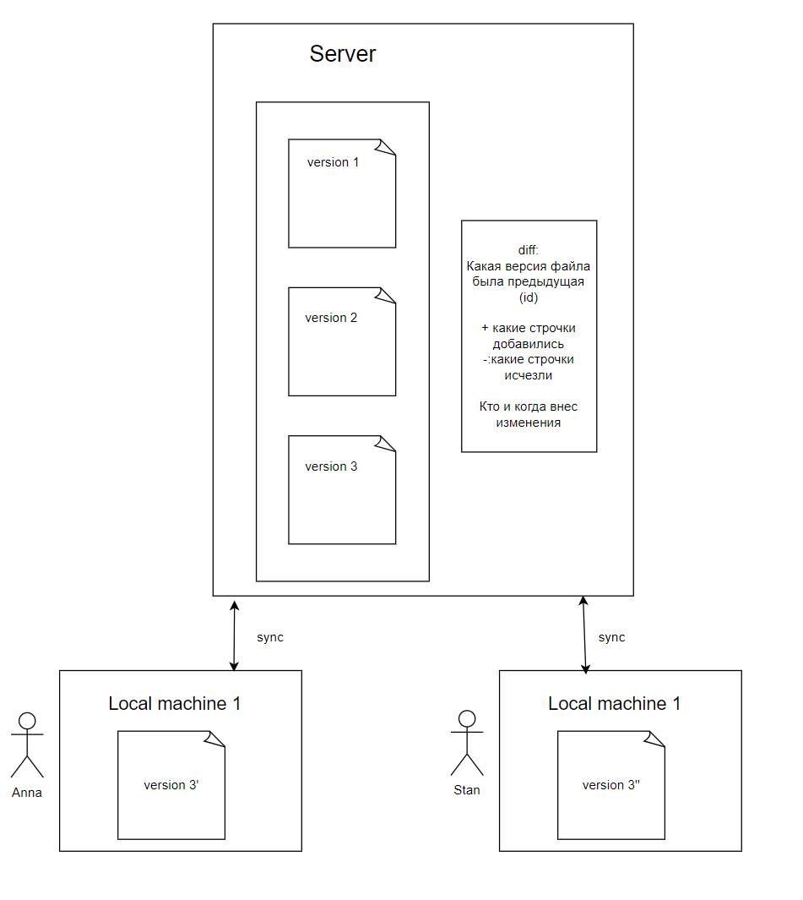
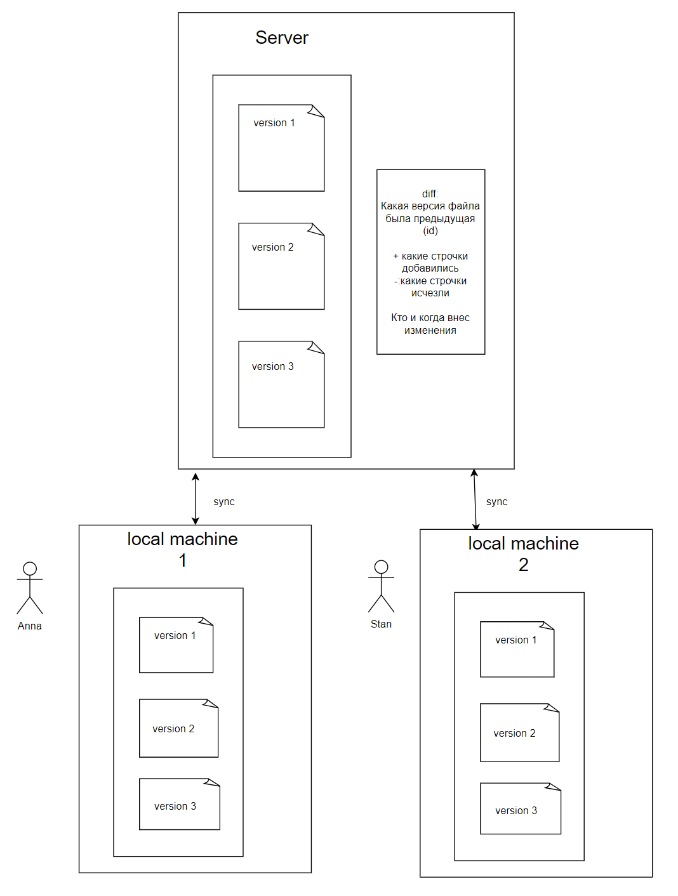
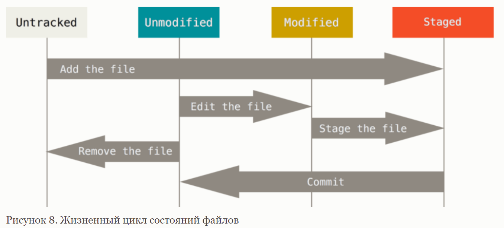

Для того чтобы выполнять задания, нам понадобится научиться работать с системами контроля версий.

# Системы контроля версий 101
Система контроля версий – это система, позволяющая сохранять различные 
версии файлов.

Скорее всего, одну из самых простых СКВ вы могли изобрести сами, если сдавали 
большие проекты у вас в школе. Например, вы написали отчет и назвали его 
"отчет", после чего отправили его на проверку учителю.
Когда он выслал вам набор правок, вы их исправили, и выслали новую версию отчета
"отчет_с_правками". 
После чего получили еще одни правки, например, по оформлению. 
Вы исправили замечания и выслали последнюю версию отчета с названием "отчет_финал".

"Отчет", "отчет_с_правками", "отчет_финал" - это разные версии одного и того же 
файла. Если придет сообщение, что оформление исправлять не надо было, 
всегда можно будет откатиться к предыдущей версии "отчет_с_правками".

### Необходимость СКВ
Современные СКВ, которыми пользуются программисты, также позволяют 
откатиться к предыдущей версии файлов. Однако функций у них гораздо больше. 
Большая часть из них заточена под корпоративную разработку.

Например, если вы работаете над проектом с кем-то, и одновременно меняете 
одни и те же строчки в коде, то СКВ позволяют вам 
объединять различные изменения, не перетирая одно из них. 

Так, основные случаи использования: 
- вы работаете над проектом с кем-то в команде 
- вы хотите знать, когда и почему вносились разные изменения 
- вам важно интегрироваться с разными трекерами задач 
- требования постоянно меняются, в том числе откатываются до прошлых
- необходимо одновременно иметь 2 версии проекта

### Типы СКВ
Обычно выделяют 3 типа СКВ: 
1. Локальные 
2. Централизованные 
3. Распределенные

#### Локальные СКВ
Типы систем контроля версий создавались по мере усложнения СКВ. Аналог системы 
с разными версиями одного и того же отчета - это и есть локальная СКВ. 

У вас есть некоторая система, которая отслеживает изменения файлов. Эти изменения
есть только у вас на компьютере и нигде больше. 

#### Централизованные СКВ
Второй логичный шаг в развитии СКВ - добавление возможности работать с нескольких устройств одновременно.

Так, у вас где-то есть сервер - такой же компьютер, как и у вас, но намного мощнее.
И все версии файлов хранятся уже у вас на сервере. А на вашем компьютере хранится только
последняя версия файлов. 

#### Распределенная СКВ 
С увеличением сложности разработки стало важным умение переключаться между различными состояниями 
кода локально. Например, вы работаете над одной фичей, а потом вам внезапно нужно переключиться на другую.

Имея полную копию проекта и на удаленном сервере, и локально, вы можете всегда иметь 
доступ ко всей истории, и одновременно с этим иметь одну главную версию всех ваших изменений на сервере

### Популярные СКВ
1. GIT
2. Subversion
3. Mercurial
4. Perforce

Мы будем работать с git. 

Скорее всего в вашей профессиональной жизни вы будете работать с 
ним же в большинстве компаний. В отдельных очень специфичных случаях вы можете
столкнуться с собственной реализацией СКВ в компании (например, если устроитесь работать
рендер инженером в компанию по разработке игр).

### Установка
Для того чтобы начать работать с гитом необходимо его установить. Для этого необходимо зайти 
на сайт https://git-scm.com/downloads, выбрать вашу ОС, скачать для нее установочный файл 
и запустить его 

В целом, часто достаточно того, чтобы вы выбрали дефолтные настройки.
На уроке мы пройдемся по всем пунктам вместе.  

Есть несколько способов работать с гитом: 
- через консоль git bash 
- через git GUI
- через графический интерфейс в IDE

Перед началом работы необходимо сказать гиту данные о вас
- git config --global user.name "Your name"
- git config --global user.email example@test.com
- git config --global core.editor nano 

FYI: есть 3 уровня настройки:
- project: настройки для текущего проекта 
- global: настройки для текущего пользователя
- system: настройки для всех пользователей

В будущем если вам понадобится настраивать данные для проектов более точечно, вы сможете это сделать,
задавая настройки на различных уровнях 

Теперь мы готовы начинать изучение гита! 

### Немного про то, как работает git
Мы начнем с изучения консольных команд. Во-первых, зная их, можно сделать намного больше, 
чем если вы просто работаете из GUI. Во-вторых, не на всех устройствах у вас будет GUI.

Демонстрацию проведем в отдельной папке test.

Картинка взята из официальной документации (https://git-scm.com/book/ru/v2/)

Изначально все файлы у вас в проекте неотслеживаемые. Для того чтобы зафиксировать какое-то
состояние проекта, необходимо сначала добавить все необходимые файлы в индекс (staged area).
Делается это с помощью команды git add filename. 

После того как вы добавляете все нужные вам файлы в индекс, с помощью команды git commit вы
фиксируете состояние всех файлов из индекса, создавая так называемый снимок (snapshot). 
При выполнении этой команды вам предложат написать сообщение коммита - строчку, в которой
будет сказано, что сделано в сохраняемых вами изменениях. Хорошее правило: 1 осмысленное 
изменение - 1 коммит.

У каждого снимка есть свой hash id - уникальный номер коммита. А также автор и сообщение
с информацией о коммите. 

Посмотреть историю коммитов можно с помощью команды git log. А разницу между двумя коммитами
командой git diff id1 id2.

### Основные команды Git в консоли
- git init - инициализация нового гит репозитория
- git status - посмотреть в каком состоянии находятся разные файлы
- git add - добавить ффайл в индекс 
- git rm - удалить файл из индекса
- git log - посмотреть историю 
- git commit - сохранить версию
- git diff - посмотреть разницу 2 коммитов
- git checkout - переключиться на коммит \ ветку 
- [git branch]

### Как сделать то же самое в IDE 
Основные команды доступны во складке git.

На следующем занятии мы разберем более подробно работу с ветками,
изучим работу с удаленными репозиториями, а также посмотрим, как сделать все намного 
проще с использованием GUI 
