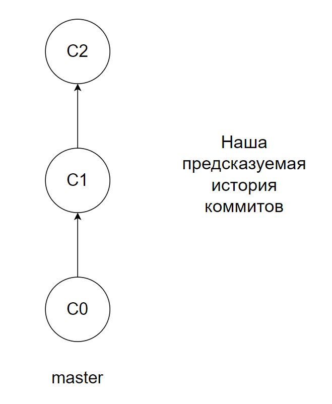
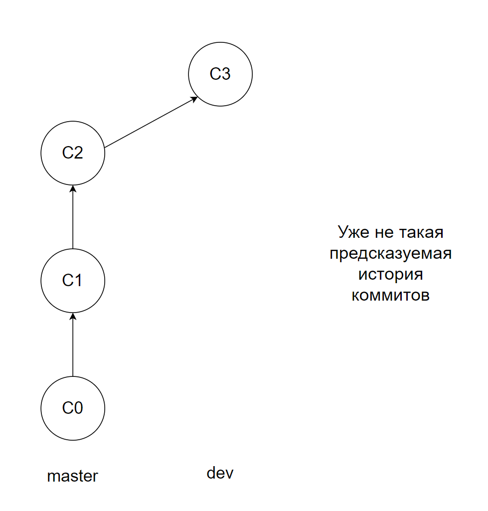
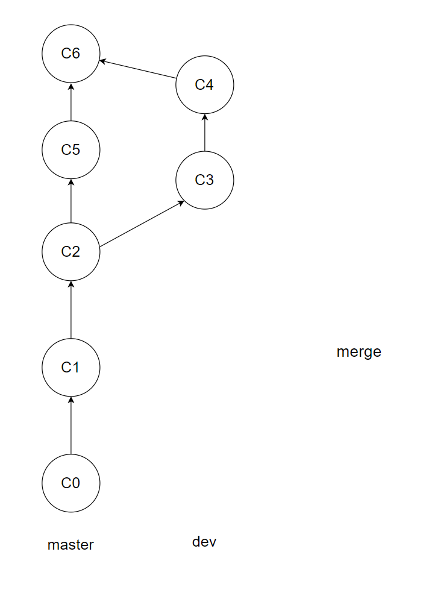
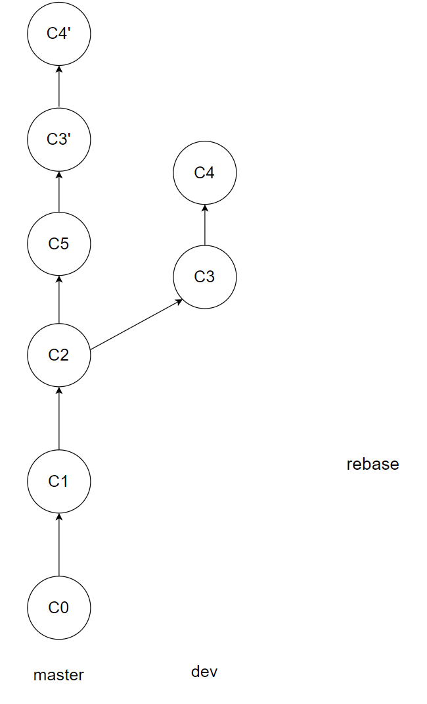

### Что было на прошлом занятии
- git init - инициализация нового гит репозитория
- git status - посмотреть в каком состоянии находятся разные файлы
- git add - добавить файл в индекс 
- git log - посмотреть историю 
- git commit - сохранить версию
- git diff - посмотреть разницу 2 коммитов

В целом, большая часть разработки может сводиться к последовательному исполнению 2 команд:
git add - git commit - git add - git commit

Но иногда в этом сценарии происходят проблемы. Давайте разберем, что делать в каждой из них

### Разбор проблем
1. Вы добавили ооооочень много файлов в проект, и вам лень делать 
git add filename на каждый файл

Решение: git add *

Данная команда добавит все файлы, которые найдет в директории. 
В том числе и скрытые + служебные файлы IDE. Эти файлы вам в репозитории 
точно не нужны - вам важно сохранить лишь исходный код проекта. Сюда же можно 
отнести работу с большими объемами тестовых данных. Хорошая практика не хранить их
в проекте, а рассказать пользователю, где он может их скачать, чтобы запустить скрипт. 

Также бывают случаи, когда у вас в репозитории существуют .env файлы. 
Такие файлы обычно хранят информацию о паролях, токенах, подключениях. 

!! Такие файлы не должны попасть в гит никаким образом, иначе кто-то другой может 
воспользоваться вашими данными для подключения к разным сервисам!! В лучшем случае 
кто-то сможет, например, отправлять сообщения от имени вашего сервиса. В худшем 
вы можете еще и влететь на деньги. 

Чтобы такие файлы не попали в проект, создаются специальные файлы - .gitignore

В них прописываются все пути \ шаблоны путей, которые не должны попасть в индекс при 
выполнении команды git add *. Пример такого файла лежит в корне этого проекта.

Совет: всегда проверяйте командой git status, что же вы надобавляли командой git add 

2. При выполнении команды git add * все же добавились какие-то файлы, которые 
вам бы не хотелось держать в проекте. 

Решение: git rm --cached filename. Данная команда удалит файл из индекса

### Как использовать 2 версии проекта 
На прошлом занятии мы говорили, что одна из причин использовать гит - чтобы 
можно было держать рабочую, стабильную, проверенную версию на сервере, и одновременно 
с этим разрабатывать новый функционал. При этом очевидно, что через некоторое время 
весь (или почти весь) функционал, который раньше был в разработке, должен переехать 
на сервер для пользователей.

В git эта проблема решается с помощью веток (branch). По дефолту мы работаем в одной ветке -
она называется master (или main, после некоторого скандала о том, что master - это как-то неэтично).

Но вот в какой-то момент мы понимаем, что хотим создавать функционал, не изменяя того, в каком состоянии 
находится ветка master. И используем команду git branch branch_name, 
чтобы создать "ответвление" от основной ветки. Теперь, переключившись на эту ветку с помощью
команды git checkout branch_name, и сделав новый коммит, мы с вами увидим, что изменения сохранились не в основной 
ветке, а в ветке branch_name. 

Проверить это довольно просто - выполните команду git checkout master (переключение на ветку master). 
Тогда вы убедитесь, что весь ваш контент вернулся к предыдущему состоянию. Новые коммиты никак не 
затронули ветку master. 

### Как устроены ветки 
На самом деле ветки - это лишь ссылка на определенный коммит.  

Проверить это нам позволяет уже известная команда git log. Если присмотреться к ее выводу, вы можете 
также увидеть названия ваших веток рядом с некоторыми commit hash id.  

То есть каждый раз, когда вы делаете новый коммит, например, в ветке dev, происходит следующее: 
1. Гит создает новый снимок вашего проекта, сохраняя всю необходимую информацию: какой коммит был прошлым, кто 
сделал коммит, когда, какие файлы были изменены. В дополнение к этому для каждого коммита создается уникальный
хэш - строка, которая позволяет уникально идентифицировать коммит среди других коммитов. 
2. лейбл dev смещается на только что созданный коммит

А команда git checkout позволяет вам перемещаться на тот коммит, который закреплен за названием ветки.
Из этого также следует, что вы можете спокойно делать git checkout с параметром hash id любого коммита, 
чтобы вернуться к его состоянию. 

### А что потом? 
После того как ваша фича готова, изменения из новой ветки должны быть слиты в ветку master. 
Локлаьно это можно выполнить с помощью ряда команд несколько команд: 
- git merge branch_with_feature (выполняется из ветки, в которую надо внести изменения). Создает новый коммит, который 
содержит в себе все изменения из branch_with_feature ветки
- git rebase branch_with_feature (выполняется из ветки, в которую надо внести изменения). Переносит все комиты один за другим 
- git cherry-pick. Переносить только определенный коммит в новую ветку. С ним мы работать не будем

merge

rebase

В большинстве случаев git выполняет команду без проблем.
Но иногда, если в разных ветках меняются одни и те же файлы, возникают конфликты. Как решать конфликты мы с вами обсудим 
на лекции по гиту перед началом разработки проекта. 

### Как сделать то же самое в IDE 
*демонстрация*
