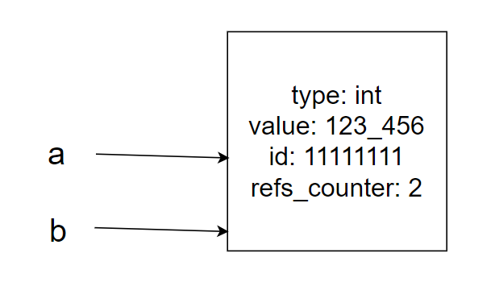

### Как представляются данные в python 
Каждый раз когда вы пишете что-то вроде 
```python
a = 123_456
```
В Python происходит следующее:
1. В памяти создается объект. У каждого объекта есть: 
- тип (int). Отвечает за то, какие операции можно делать с объектом
- значение (123_456). Отвечает за хранение конкретного значения в памяти
- уникальный id. Значение, которое генерируется Python.  Позволяет отличать один объект от другого
- счетчик ссылок. Отвечает за количество переменных, которые ссылаются на текущий объект. Это нужно чтобы Python мог проводить сборку мусора, избавляясь от неиспользуемых переменных
2. Название переменной (а) связывается с только что созданным объектом. В этом случае 'a' как
бы является этикеткой, которую клеют на только что созданный объект

Визуально это можно представить так: 


Чтобы узнать параметры только что созданного объекта, мы можем воспользоваться 
следующими функциями:
- id(a)
- type(a)
- sys.getrefcount(a) (предварительно импортировав библиотеку sys)

Каждый раз когда мы пишем код вида 
```python
a = 123_456
b = a
```
новый объект не создается. Вместо этого переменная b начинает ссылаться на тот же объект, что
и переменная a


Соответственно, все операции, изменяющие эту область памяти, будут затрагивать все переменные.

Проверить, ссылаются ли переменные на одну область памяти, можно используя команду is. 
Проверить равенство значений можно командой ==.

!Внимание! Иногда Python оптимизирует создание новых переменных, ссылаясь на уже созданные.
В этом случае id у переменных с одинаковыми значениями будут совпадать. 

### Что происходит с последовательностями
В Python есть 2 механизма хранения последовательностей: 
- плоские (например строки)
- контейнерные (например кортежи и списки)

В каждом случае у последовательности есть уникальный id и набор значений. Разница в том, как
эти значения хранятся. 

Когда мы создаем списки, то происходит примерно следующее:


Причина, по которой Python позволяет хранить в списках данные любого типа, 
заключается именно в этом - списки хранят ссылки на объекты, а не сами значения объектов. 


Если мы присвоим другому списку ссылку на первый список, то мы сможем менять один и тот же 
список через любую из ссылок. 

### Почему это важно?
Типы данных в Python можно разбить на 2 группы: изменяемые и неизменяемые.
К изменяемым типам относятся списки, словари, множества и массивы байтов. 
К неизменяемым числа, булевы значения, строки, кортежи, frozensets и bytes. 

Под неизменяемостью (immutability) в python понимается именно неизменяемость ссылок.

Именно поэтому изменяемые объекты внутри tuple (например списки) все еще можно менять. 
В этот момент вы меняете сами объекты, а не ссылки на них. 

### Как быть, если вам нужен независимый объект?
Копировать его. Для этого существуют несколько способов. 
1. Глубокое копирование - копирование, при котором рекурсивно будут созданы новые объекты для всех
вложенных структур. Занимает очень много времени. Реализуется через операцию deepcopy модуля copy
2. Поверхностное копирование. Создает копии только на первом уровне вложенности. 
Для этого используются:
- Операция copy модуля copy
- Слайсы вида [:]
- Функции преобразования типа (list, set, dict, etc)

В следующей серии:
- Механизм работы списков, множеств и словарей 
- Создание многомерных структур данных
