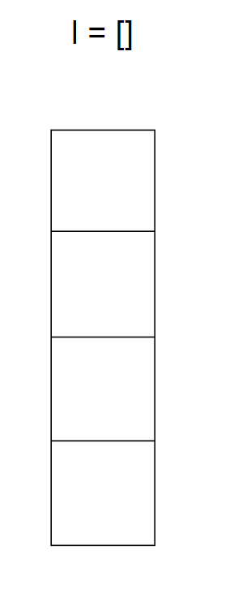
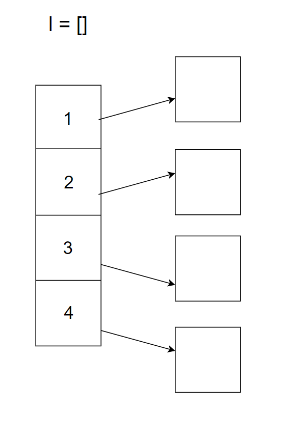
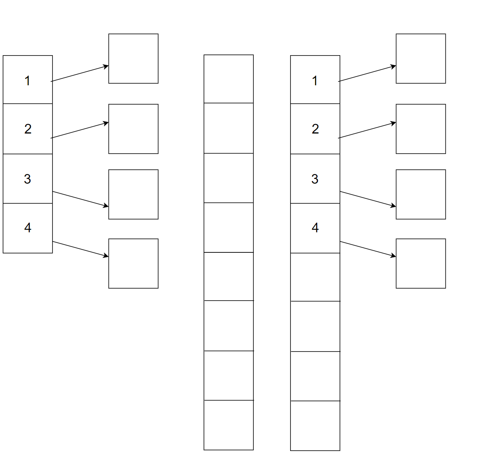
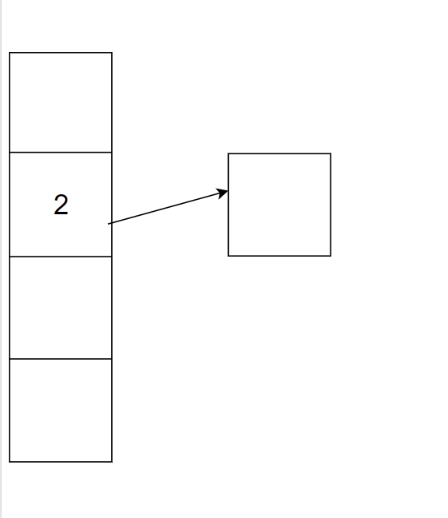

# Типы данных in depth 
На этом занятии: 
- Механизм работы всяких списков и прочего;
- Правильное создание многомерных структур данных;

## Механизмы работы списков и прочего 
Когда мы думаем о том, чтобы хранить много данных, сразу возникает вопрос об оптимальных структурах
для этого. Для каждой встроенной структуры можно рассматривать такие операции: 
- вставка значения 
- поиск значения 
- удаление значения

Встроенные типы: 
- list
- dict
- set

Как они устроены? 

### Список 
Списки - структуры данных, которые обеспечивают последовательный доступ к элементам.
Мы используем его всегда, когда нам важно сохранить порядок добавления новых элементов. 

В самой распространенной версии интерпретатора Python - CPython - списки представляют из себя некоторую структуру,
написанную на языке Си.
В нем хранятся следующие значения: 
- ссылки на объекты (значения, которые мы храним в списках)
- указатель на последний элемент 
- количество памяти, выделенное под список 

Когда мы создаем пустой список, Python в памяти выделяет вот такую структуру: 


Как видно на рисунке, несмотря на то, что в списке ничего нет, у нас все равно выделено 4 ячейки памяти. 

Каждый раз, вставляя новое значение в конец списка, мы добавляем ссылку на него в конец списка.


Самое интересное происходит тогда, когда мы заполняем первоначально выделенное под списки пространство.
В этом случае нам необходимо больше памяти, чем уже выделено. И тогда происходит следующее. 

1. Создается новый список, размер которого 2 раза больше, чем предыдущий 
2. Все значения копируются из старого списка в новый список 

Эта операция занимает время. Поэтому при добавлении новых элементов методом append скрипты могут притормаживать. 
Аналогичная ситуация происходит и при удалении последнего элемента из списка - его количество значений у нас меньше 
половины размера выделенного под список пространства, то происходит его упаковка в более компактную структуру. 

Описанное выше относилось к операциям записи и удаления значений в конце. Если нам нужно вставить значение в 
произвольном месте, то в списке произойдет следующее: 
1. Вы добавите значение на нужное вам место 
2. Все остальные значения будут сдвинуты на следующую позицию. 

Вторая операция как раз делает неоптимальными операции вставки в список. 

Поиск по спискам ведется последовательно. Это означает, что в худшем случае вам придется пройтись по всем элементам списка, 
чтобы найти нужное вам значение 
Более подробные примеры можно посмотреть в статье на хабре: https://habr.com/ru/articles/273045/

### Словари и множества
Более оптимально устроены словари и множества. Словари - первая структура данных, которая появилась в Python. 
На ней построено многое, что есть в языке. 

Как устроен словарь в CPython: 
В начале выделяется все те же 4 условные ячейки памяти. Магия происходит, когда мы хотим вставить новое значение. 

В первую очередь мы считаем некоторый хэш от значения. Хэш-функция - это функция, которая преобразовывает любой ваш 
объект в число. Обычно хэг от числа - это само число. Хэш от строк считается более сложным способом, например, через 
их коды. 

Новое значение мы вставляем как раз по адресу хэша. 


Что может пойти не так: 
1. Слишком большие значения -> берем остаток от значения
2. Коллизии -> ситуации, когда на разные значения у нас одни и те же хэши -> храним ключи, используем алгоритм 
генерации псевдорандомных сдвигов 
3. Слишком много значений -> то же самое, что и в списках

Когда что-то может пойти не так:
```python
l = {1: 'yes', True: 'no', 1.0: 'may be'}
```

Каждый раз, когда мы будем искать значение в словаре, мы в начале будем считать хэш сумму от ключа, который мы ищем, 
идти по этому адресу и сравнивать ключи.  К слову, это также является причиной, по которой ключи не могут быть изменяемыми. 

По изученному понятно, что очень быстро в списках и словарях выполянются любые операции вставки, поиска и удаления.

### правильные механизмы формирования спсиков и прочего
Как мы увидели на этом занятии, механизм расширения списков - не самая оптимальная операция. 
Есть ряд модификаций: 
1. list comprehension 
```python
l = [i for i in range(5)]
l_even = [i for i in range(5) if i % 2 == 0]
l_complex = [[j for j in range(i)] for i in range(5)]
```

Ремарка: такие штуки бывает сложно читать. Иногда лучше пожертвовать временем исполнения, чтобы получить более читаемый 
код. 

2. dict comprehension 
```python
d = {i: i for i in range(5)}
d_even = {i: i + 100 for i in range(5) if i % 2 == 0}
```

3. set comprehensions 
```python
s = {i for i in range(5)}
s_even = {i + 100 for i in range(5) if i % 2 == 0}
```

4. Создаем генераторы: 
```python
d = (i for i in range(5))
```
! Эта конструкция не создает tuple! Отличие генератора от остальных конструкций в том, что у вас не формируется 
список со всеми значениями сразу - генератор возвращает по 1 значению за раз, что делает его оптимальным для работы 
с большим количеством значений. 